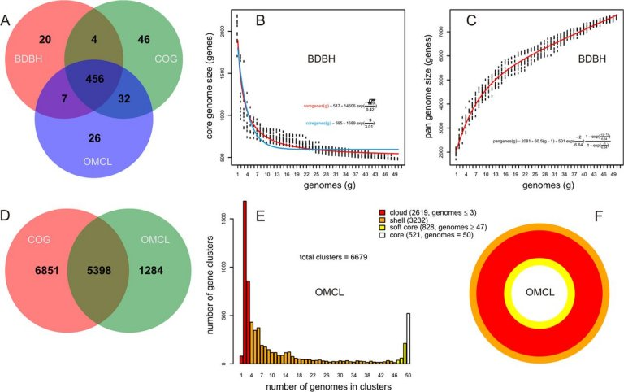
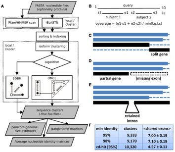

## GET_HOMOLOGUES: a versatile software package for pan-genome analysis

This software is maintained by Bruno Contreras-Moreira (bcontreras _at_ eead.csic.es) and Pablo Vinuesa (vinuesa _at_ ccg.unam.mx). 
The original version, **suitable for bacterial genomes**, was described in:

[Contreras-Moreira B, Vinuesa P (2013) Appl. Environ. Microbiol. 79:7696-7701](http://aem.asm.org/content/79/24/7696.long)

[Vinuesa P, Contreras-Moreira B (2015) Methods in Molecular Biology Volume 1231, 203-232](http://link.springer.com/protocol/10.1007%2F978-1-4939-1720-4_14)

The software was then adapted to the study of **intra-specific eukaryotic pan-genomes** resulting in script GET_HOMOLOGUES-EST, described in:

[Contreras-Moreira B, Cantalapiedra CP et al (2017) Front. Plant Sci. 10.3389/fpls.2017.00184](http://journal.frontiersin.org/article/10.3389/fpls.2017.00184/full)

GET_HOMOLOGUES-EST was benchmarked with genomes and transcriptomes of *Arabidopsis thaliana* and *Hordeum vulgare*, available at [http://floresta.eead.csic.es/plant-pan-genomes](http://floresta.eead.csic.es/plant-pan-genomes), and used to analyze the pan-genomes of [*Brachypodium distachyon*](https://brachypan.jgi.doe.gov) and [*Brachypodium hybridum*](http://floresta.eead.csic.es/plant-pan-genomes/Bhybridum) ([press release](https://jgi.doe.gov/more-the-merrier-making-case-for-plant-pan-genomes)).

A [tutorial](http://eead-csic-compbio.github.io/get_homologues/tutorial/pangenome_tutorial.html) is available, covering typical examples of both GET_HOMOLOGUES (bacteria) and GET_HOMOLOGUES-EST (plants). 

<!--There are also afew examples on how to analyze data from [Ensembl Plants](http://plants.ensembl.org) at [https://github.com/Ensembl/plant_tools/tree/master/compara](https://github.com/Ensembl/plant_tools/tree/master/compara). -->

A [Docker image](https://hub.docker.com/r/csicunam/get_homologues) is available with GET_HOMOLOGUES 
bundled with [GET_PHYLOMARKERS](https://github.com/vinuesa/get_phylomarkers), ready to use. 
The GET_PHYLOMARKERS [manual](https://vinuesa.github.io/get_phylomarkers) 
explains how to use nucleotide & peptide clusters produced by GET_HOMOLOGUES to compute robust multi-gene and pangenome phylogenies.

The code is regularly patched (see [CHANGES.txt](./CHANGES.txt) in each release, <!--and [TODO.txt](./TODO.txt)),-->
and has been used in a variety of studies 
(see citing papers [here](https://scholar.google.es/scholar?start=0&hl=en&as_sdt=2005&cites=5259912818944685430) and 
[here](https://scholar.google.es/scholar?oi=bibs&hl=en&cites=14330917787074873427&as_sdt=5), respectively).

We kindly ask you to report errors or bugs in the program to the authors and to acknowledge the use of the program in scientific publications.

*Funding:* Fundacion ARAID, Consejo Superior de Investigaciones Cientificas, DGAPA-PAPIIT UNAM, CONACyT, FEDER, MINECO, DGA-Obra Social La Caixa.

  

Installation instructions are summarized on [README.txt](./README.txt) and full documentation is available in two flavours:

|version|HTML|
|-------|----|
|original, for the analysis of bacterial pan-genomes|[manual](http://eead-csic-compbio.github.io/get_homologues/manual/)|
|EST, for the analysis of intra-species eukaryotic pan-genomes, tested on plants|[manual-est](http://eead-csic-compbio.github.io/get_homologues/manual-est/)|

