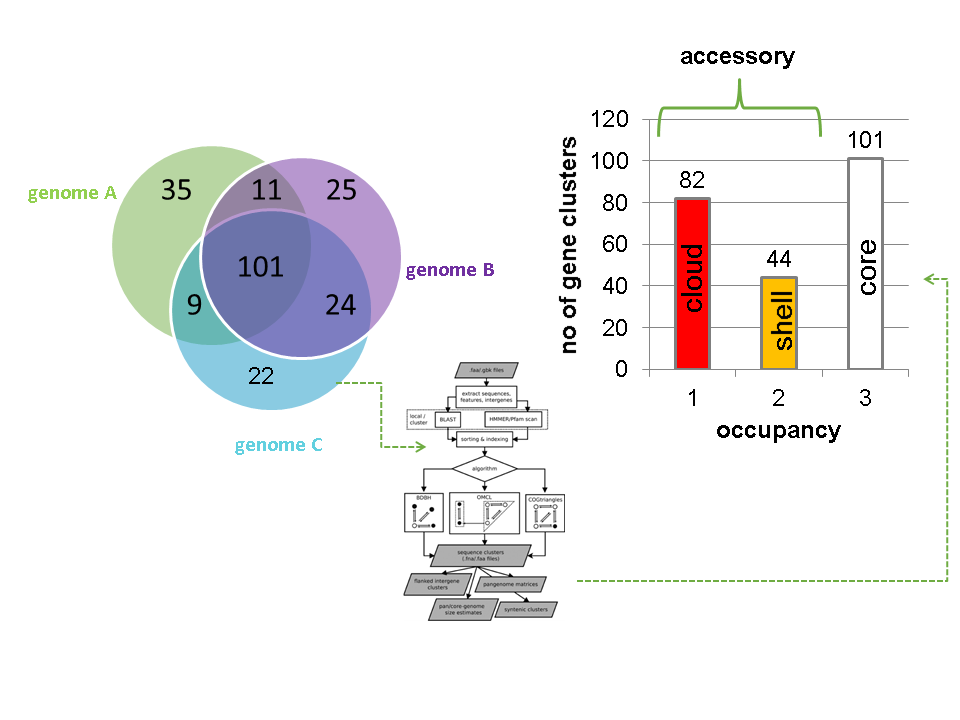
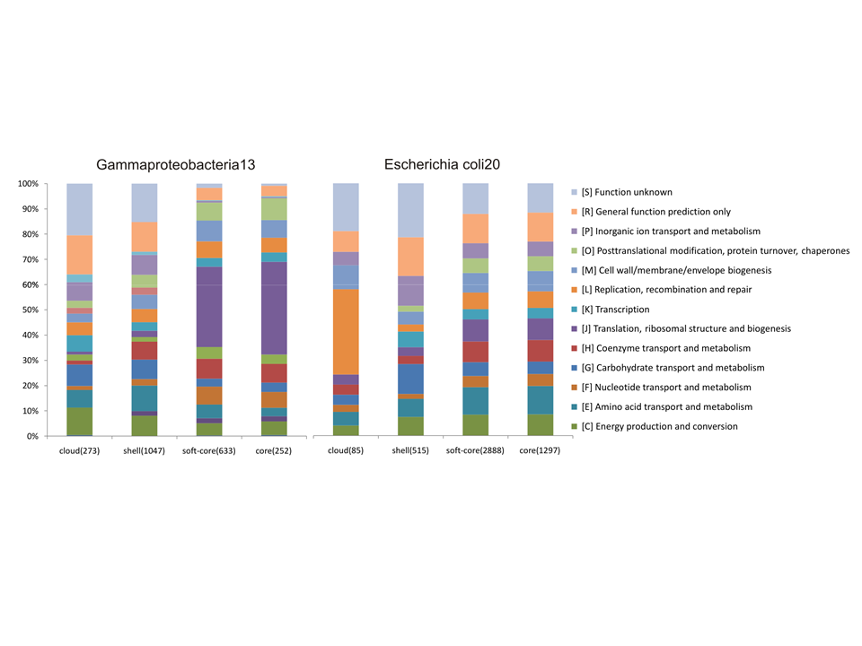
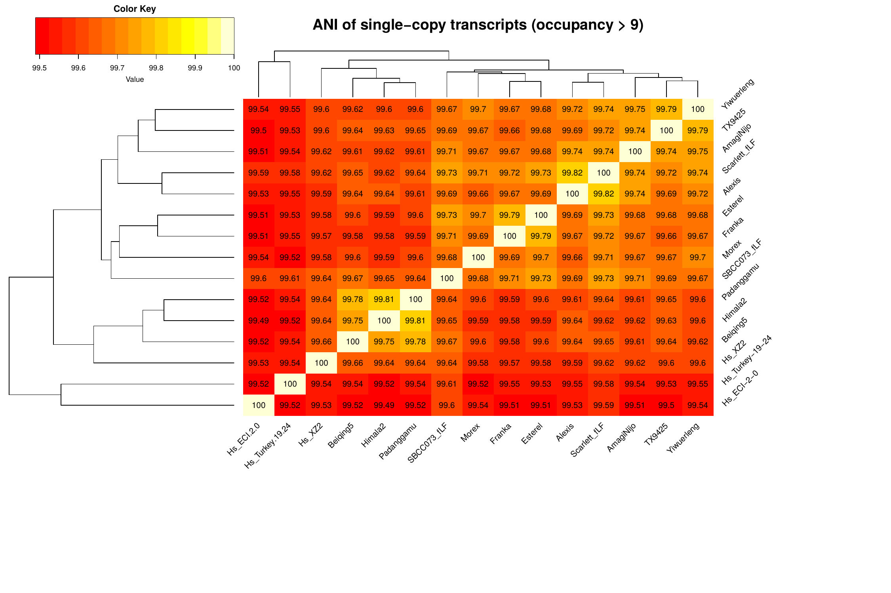
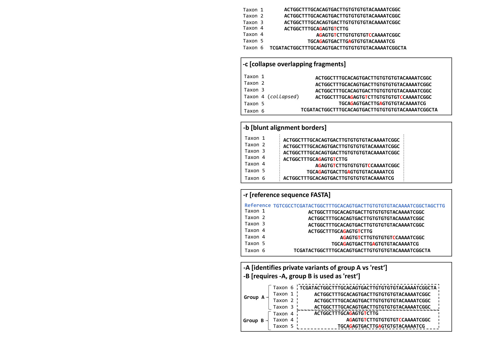
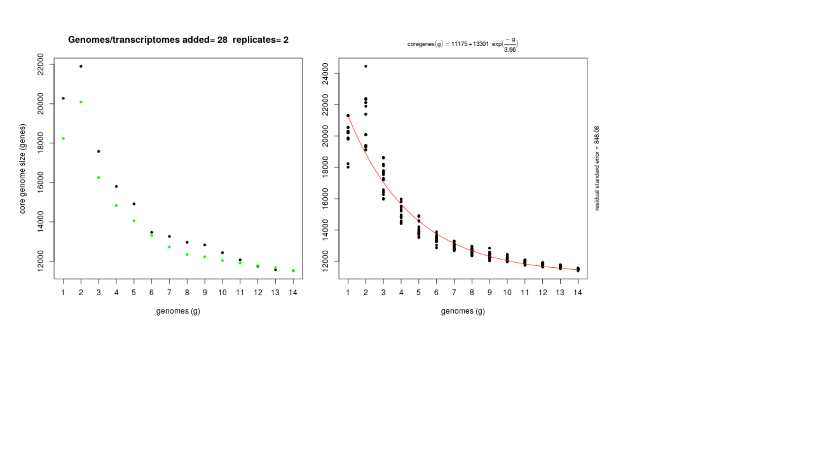

```{r knitr setup, include=FALSE,  eval=TRUE, echo=FALSE, warning=FALSE}
library(knitr)
knitr::opts_chunk$set(echo=TRUE, eval=TRUE, cache=FALSE, message=FALSE, warning=FALSE, comment = "")
```

# Pangenome analysis of plant transcripts and coding sequences

Bruno Contreras-Moreira (1)*, Alvaro Rodriguez del Rio (1), Carlos P. Cantalapiedra (1), Ruben Sancho (2) and Pablo Vinuesa (3)

1. Estación Experimental de Aula Dei-CSIC, Av. Montañana 1.005, 50059 Zaragoza, Spain.
2. Department of Agricultural and Environmental Sciences, High Polytechnic School of Huesca, University of Zaragoza, Huesca, Spain.
3. Centro de Ciencias Genómicas, Universidad Nacional Autónoma de México, Cuernavaca, Mexico.

* Corresponding author: Bruno Contreras Moreira <bcontreras@eead.csic.es>

## i. Summary/Abstract

The pangenome of a species is the sum of the genomes of its individuals. However, coding sequences often represent only a small fraction of each genome, and thus analyzing the pan-gene set can be a cost-efective strategy for plants with large genomes or highly heterzygous species. Here we describe a step-by-step protocol to analyze plant pan-gene sets with the software GET_HOMOLOGUES-EST. After a short introduction, where the main concepts are illustrated, the remaining sections cover the installation and typical operations required to analyze and annotate pan-transcriptomes and gene sets of plants. The recipes include how to call core and accessory genes, how to compute a presence-absence pan-genome matrix and how to identify and analyze private genes, present only in some genotypes. Possible downstream phylogenetic analyses are also discussed.

### ii. Key Words

- Pangenome, pan-gene set, crops, model plants, wild plants, polyploids, scripting

### iv. Running head

Defining pan-gene sets with GET_HOMOLOGUES-EST


## 1. Introduction

### 1.1 Background

A pangenome can be defined as the sum of the core genome, shared by all individuals of a species, plus the dispensable genome, which includes partially shared and population-specific genes [@Tettelin2005].  Among plants, previous work has compared ecotypes of model species and cultivars of crops such as maize, barley, soybean, or rice, revealing that dispensable genes play important roles in evolution, and in the complex interplay between plants and the environment (reviewed at [@Golicz2020]). For these reasons we prefer to rename dispensable genes as “accessory” or "shell" genes, terms borrowed from microbiology [@Laing2010]. Moreover, accounting for accessory genomic features improves the association of genotypes to phenotypes beyond SNPs called on a single reference genome [@Yano2016; @Coletta2021]. In summary, pangenomes are the new reference sequences for plant genomic studies [@Bayer2020].

The data structures used to represent pangenomes are evolving in parallel with the sequencing technologies,
and the state-of-the-art are the so called pangenome graphs, with multiple implementations (see for instance [@Sheikhizadeh2016]). Graphs have been shown to significantly improve variant calling by read mapping [@Eizenga2020; @Coletta2021]. However, there are currently no community accepted solutions for visualizing or setting coordinate system in genome graphs. More importantly, the input genome sequences used to construct a graph need to be highly contiguous. This contrasts with most plant genome assemblies found in the public archives, which are often fragmented, particularly for species with large, highly repetitive, heterozygous and polyploid genomes. For these reasons, approaches that do not require a fully-assembled reference genome are of interest for plant breeding and ecology. Some of those strategies reduce the natural complexity of genomes by computing the frequency of nucleotide words and looking for enriched words [@Arora2019; @Voichek2020]. Other strategies, like the one presented in this protocol around GET_HOMOLOGUES-EST [@ContrerasMoreira2017], take transcripts or coding sequences as the genomic unit of interest (see examples at [@Gordon2017; @Gordon2020]).
Therefore, a more appropriate name for this approach would be pan-gene set analysis. 

Compared to whole genome sequencing (WGS) and assemblying, pan-gene analyses have the advantage of sampling only the expressed fraction of the genome, the transcriptome. Recent technological advances, such as single-molecule long-read sequencing, are producing transcripts with unprecented accuracy [@Wang2016], even without a reference genome [@Minio2019]. Their main disadvantage is that variation in non-expressed sequences cannot be sampled. Nevertheless, the definition of pan-gene sets is a necessary step for pangenome projects of crops and plants, as a way to deduce consistent gene collections with uniform nomenclature across genotypes.

### 1.2 Pangenome history and concepts

In 2002 Welch and colleagues [@Welch2002] compared the genome sequences of three strains of the bacteria *Escherichia coli*, two of them pathogens, and found shared genes, which mostly conserve their positions in the genome, and also accessory genes, which are encoded only in some strains. Three years later, Tettelin and collaborators [@Tettelin2005] analyzed 8 strains of a Gram+ bacteria and for the first time defined the pangenome as a core genome shared by all strains, plus a dispensable genome consisting of partially shared and strain-specific genes. In addition, a mathematical model suggested that the pan-genome of *Streptococcus agalactiae* might be very large (open) and that unique genes would continue to be identified in newly sequenced strains. In 2007 Morgante and co-workers [@Morgante2007] took these ideas and proposed a role for transposable elements (TEs) in generating the dispensable genomic components that differentiate maize inbred lines B73 and Mo17. A few years later they concluded these components might not be dispensable after all [@Marroni2014]. In order to make this classification problem more tractable, dispensability scores are now being computed [@Sielemann2021].

__Figure 1__ summarizes the computational analysis of the pan-gene set of three toy genomes with software GET_HOMOLOGUES-EST. Note that occupancy is defined as the number of genomes/cultivars/ecotypes present in a sequence cluster and in this example takes values from 1 to 3 (see also definitions in __Table 1__). Core loci are found in all three genomes and hence have occupancy=3 in the example. Accessory loci are allocated to shell and cloud compartments. Although not shown in the figure, it's often convenient to define a fourth class, the soft-core, which is a relaxed core that tolerates assembly and annotation errors.



In addition to occupancy differences, previous benchmarks have shown that occupancy-based classes differ in their functional annotations. The examples in __Figure 2__ are for two bacterial clades, but note that similar observations have been made in plants [@ContrerasMoreira2017; @Gordon2017]:

 

## 2. Materials

The **GET_HOMOLOGUES** software was originally designed for the analysis of bacterial genomes, and has been described in [@ContrerasMoreira2013; @Vinuesa2015]. That software was then adapted to the study of intra-specific eukaryotic pan-gene sets, as described in [@ContrerasMoreira2017], taking the **GET_HOMOLOGUES-EST** name. Its source code and documentation can be found at <https://github.com/eead-csic-compbio/get_homologues>. __Table 2__ summarizes the main differences between the two flavours of the software. In this protocol we will use GET_HOMOLOGUES-EST (see __Note __^[Read [@Golicz2016] for other alternatives.]).

### 2.1 Installation and up-to-date documentation

GET_HOMOLOGUES-EST is an open source software package, written in Perl and R, 
available for Linux and MacOS systems. A manual is available at <http://eead-csic-compbio.github.io/get_homologues/manual-est> (see __Note __^[The bacterial manual at <http://eead-csic-compbio.github.io/get_homologues/manual> can be also be useful.]).

#### 2.1.1 Latest binary release

The simplest way to get the current release of GET_HOMOLOGUES is to check
<https://github.com/eead-csic-compbio/get_homologues/releases>, download it and extract it in your local filesystem. Let's assume we have a dedicated folder called *soft*:

```{r, engine='bash', eval=FALSE}
cd soft

# make sure you choose the right version
wget -c https://github.com/eead-csic-compbio/get_homologues/releases/download/v3.4.1/get_homologues-x86_64-20210217.tgz
#get -c https://github.com/eead-csic-compbio/get_homologues/releases/download/v3.4.1/get_homologues-macosx-20210217.tgz

tar xvfz get_homologues-x86_64-20210217.tgz
```

Releases include scripts (Perl and R), documentation, sample data and the required binary dependencies, which are listed in __Table 3__ and discussed in the manual. For this tutorial the following dependencies were also installed on Ubuntu:

```{r, engine='bash', eval=FALSE}
sudo apt-get install git htop geeqie evince default-jre
sudo apt-get -y install r-base r-base-dev
sudo cpan -i Inline::C Inline::CPP
```

#### 2.1.2 GitHub clone / pull

A more sustainable way of obtaining the software is to use the software git.
For this you might need to install *git* in your system. Note also that the *git* protocol requires to open port 9418, which might be blocked by your firewall. This method does not include the binary dependencies, which must downloaded during installation:

```{r, engine='bash', eval=FALSE}
cd soft
git clone https://github.com/eead-csic-compbio/get_homologues.git
cd get_homologues
perl install.pl
```
Note this will create a folder called *get_homologues*.

This approach makes future updates very simple, after moving to the git repository:
```{r, engine='bash', eval=FALSE}
cd soft/get_homologues
git pull
```

#### 2.1.3 Recommended optional dependencies, such as Pfam and SwissProt

In order to annotate protein domains and to translate open reading frames (ORFs) a couple of databases must be downloaded and formatted. These are Pfam [@Mistry2021] and SwissProt [@Bateman2021], which you can download and format as follows in the terminal:

```{r, engine='bash', eval=FALSE}
cd soft/get_homologues
perl install.pl
```
You should be able to control the installation process by typing Y or N in the terminal.
Note that this script will also tell you of missing dependencies. 

#### 2.1.4 Docker container

A way to use GET_HOMOLOGUES-EST with all dependencies pre-installed is the Docker image available at 
[dockerhub](https://hub.docker.com/r/csicunam/get_homologues). This container includes also [GET_PHYLOMARKERS](https://github.com/vinuesa/get_phylomarkers). 

#### 2.1.5 High performance cluster (HPC) configuration

In order to prepare your installation to run on a computer cluster please follow the instructions in section "Optional software dependencies" of the manual. Three job managers are currently supported: gridengine, LSF and Slurm. The default configuration is for gridengine, but this can be changed by creating a file named "HPC.conf" and setting appropriate values and paths for your HPC cluster. The sample configuration file looks like this:

    cat sample.HPC.conf 
    # cluster/farm configuration file, edit as needed (use spaces or tabs)
    # comment lines start with #
    # PATH might be empty or set to a path/ ending with '/'
    # QARGS might be empty or contain specific queue name, resources, etc 
    #
    # example configuration for LSF
    #PATH	/lsf/10.1/linux3.10-glibc2.17-x86_64/bin/
    TYPE	lsf
    SUBEXE	bsub
    CHKEXE	bjobs
    DELEXE	bkill
    ERROR	EXIT
    # 
    # example configuration for slurm
    TYPE	slurm
    SUBEXE	sbatch
    CHKEXE	squeue
    DELEXE	scancel
    ERROR	F


While calling GET_HOMOLOGUES-EST with several CPU cores speeds up the batch of BLASTN jobs, only when using a cluster the actual sequence clustering can be done in parallel, which is recommended particularly if you plan to analyze a large number of transcriptomes.

## 3. Methods

### 3.1 The main _get_homologues-est.pl_ script

Unlike its predecessor, which was designed for the analysis of genes within fully sequenced genomes, 
GET_HOMOLOGUES-EST has been adapted to the large size of plant genomic data sets, and adds new features to adequately handle redundant and fragmented transcript sequences, as those usually obtained from transcript profiling experiments, as well as incomplete/fragmented gene models from WGS assemblies. Sequence clusters can be produced using the bidirectional best-hit or the OrthoMCL [@Li2003] algorithms.The granularity of the clusters can be tuned by a configurable filtering strategy based on a combination of BLAST pairwise alignment parameters and, optionally, hmmscan-based scanning of Pfam domain composition of the proteins encoded in each cluster. By default redundant sequences are removed from input sets if they overlap a longer identical sequence over a length $\geq 40$ or when they are completely matched. This is to prevent BLAST results being biased by transcript isoforms [@Pertea2003]. If your input are annotated CDS sequences this behavior can be disabled with option -i 0 . 

As summarized in __Figure 3__, the main script _get_homologues-est.pl_ can produce different outputs:

 + Sequence clusters based on nucleotide similarity, which provide higher resolution than peptide comparisons.
 + Presence-absence pan-genome matrices in different formats, which can be easily transformed and exported for different applications.
 + Simulations on the growth of the pangenome at the gene level using different fits [@Tettelin2005; @Willenbrock2007] and mixture models [@Snipen2009].
 + Average nucleotide sequence identity (ANI) matrices, which contain average sequence identity values among pairs of genomes, computed from clustered sequences. These values are derived from BLASTN alignments. 
 + Matrices of percentage of conserved sequence clusters (POCS), which contain the % of clusters that contain sequence from every two species being compared [@Qin2014].


As assembled transcripts are often incomplete, and gene models might contain errors, by default GET_HOMOLOGUES-EST computes alignment coverage with respect to the shortest sequence. This adds robustness against split genes, partial genes and genes or transcripts with retained introns [@ContrerasMoreira2017]. 


### 3.2 Other scripts

A few scripts are bundled with GET_HOMOLOGUES-EST to assist in the interpretation of results. We will use some of them in this protocol:

 + _compare_clusters.pl_ primarily calculates the intersection between cluster sets, which can be used to select clusters supported by different algorithms or settings. This script can also produce pangenome matrices and Venn diagrams.

 + _parse_pangenome_matrix.pl_ can be used to analyze pan-genome sets, in order to find transcripts/genes present in a group A of strains which are absent in set B. This script can also be used for calculating and plotting cloud, shell and core genome compartments with mixture models.

 + _plot_pancore_matrix.pl_ plots pan/soft/core-genome sampling results and fits regression curves with help from R functions.

 + _check_BDBHs.pl_ can be used, after a previous _get_homologues-est.pl_ run, to find out the bidirectional best hits of a sequence identifier chosen by the user. It can also retrieve its Pfam annotations.

 + _annotate_cluster.pl_ produces a multiple alignment view of the supporting local BLAST alignments of sequences in a cluster. It can also annotate Pfam domains and find private sequence variants private to an arbitrary group of sequences.

 + _plot_matrix_heatmap.sh_ calculates ordered heatmaps with attached row and column dendrograms from tab-separated numeric matrices, which can be presence/absence pangenomic matrices or identity matrices as those produced by get_homologues-est with flag -A. Requires R packages ape [@Popescu2012], dendextend (<https://cran.r-project.org/package=dendextend>), factoextra (<https://cran.r-project.org/package=factoextra>) and gplots (<https://CRAN.R-project.org/package=gplots>).

 + _pfam_enrich.pl_ calculates the enrichment of a set of sequence clusters in terms of Pfam domains, by using Fisher's exact test.

Apart from these, scripts *transcripts2cds.pl* and *transcripts2cdsCPP.pl* are also bundled to assist in the analysis of transcripts. They can be used to annotate potential ORFs contained within raw transcripts, which might be truncated or contain retained introns. The CPP version is faster but requires some optional Perl dependencies (which you should have installed earlier). These scripts use TransDecoder and BLASTX (see __Table 3__) to scan protein sequences in SWISSPROT (see __Note __^[See benchmark in [@ContrerasMoreira2017]; DIAMOND can also be used with significant gains in computing time and very small sensitivity losses, as shown in the manual.]). 

### 3.3 Protocol for plant transcripts and CDS sequences

In this section we present a step-by-step protocol for the analysis of *Hordeum vulgare* WGS-based cDNA sequences, annotated in reference cultivars *Morex* and *Haruna Nijo*, and *de novo* assembled transcriptomes.
These sequence sets were first used in [@ContrerasMoreira2017]. For convenience, these barley sequences can be obtained as explained below from files included in the *test_barley* folder, which should be bundled with your copy of GET_HOMOLOGUES. Similar analyses could be performed with the  *Arabidopsis thaliana* and *Brachypodium hybridum* sequences at <http://floresta.eead.csic.es/plant-pan-genomes/>

We can start by defining an enviromental variable pointing to our install destination:

```{r, engine='bash', eval=FALSE}
# set GET_HOMOLOGUES path, for example:
export GETHOMS=~/soft/get_homologues
```

<!-- 
4.2 Clustering orthologous transcripts from FASTA files, one per strain
4.3 Producing a nucleotide-based pangenome matrix
4.4 Estimating protein domain enrichment of some sequence clusters
4.5 Making and annotating a non-redundant pangenome matrix
4.6 Annotating a sequence cluster -->

#### 3.3.1 Preparing input sequences, outgroups and extracting CDS from transcripts

The main script reads in sequences in FASTA format, which might be GZIP- or BZIP2-compressed, contained in a folder containing at least two files with extension .fna, one per cultivar/ecotype. You should consider adding also sequences from one or more outgroups if you plan to run downstream phylogenomic analyses with the resulting clusters. In either case, nucleotide .fna files might have twin .faa files with translated amino acid sequences in the same order. Peptide files are optional, as this allows clustering any kind of nucleotide sequences, such as conserved intergenic regions or transposons. However, you will need .faa files to run Pfam-based analyses and the phylogenomics recipes of GET_PHYLOMARKERS [@Vinuesa2018]. 

Peptide files can be downloaded from resources such as [Ensembl Plants](http://plants.ensembl.org) [@Howe2019] or [Phytozome](https://phytozome.jgi.doe.gov) [@Goodstein2012], or deduced with script *transcripts2cds.pl*, as in the example:

```{r, engine='bash', eval=FALSE}
$GETHOMS/transcripts2cds.pl -n 3 $GETHOMS/sample_transcripts.fna

# ./transcripts2cds.pl -p 0 -m  -d $GETHOMS/db/uniprot_sprot.fasta -E 1e-05 -l 50 -g 1 -n 3 -X 0
# input files(s):
# sample_transcripts.fna

## processing file sample_transcripts.fna ...
# parsing re-used transdecoder output (_sample_transcripts.fna_l50.transdecoder.cds.gz) ...
# running blastx...
# parsing blastx output (_sample_transcripts.fna_E1e-05.blastx.gz) ...
# calculating consensus sequences ...
# input transcripts = 9
# transcripts with ORFs = 7
# transcripts with no ORFs = 2
# output files: sample_transcripts.fna_l50_E1e-05.transcript.fna , sample_transcripts.fna_l50_E1e-05.cds.fna , sample_transcripts.fna_l50_E1e-05.cds.faa , sample_transcripts.fna_l50_E1e-05.noORF.fna
```

Other analyses you might want to carry out on your input sequences include computing their coding potential or their gene completeness (see __Note __^[Software choices include CPC2 and RNAsamba [@Kang2017; @Camargo2020], trained on human truth sets, and BUSCO [@Seppey2019]]).

Note that filenames matching the tag 'flcdna' are handled as full-length transcripts, and this information will be used downstream in order to estimate coverage. By default only sequences with length length $\geq 20$ bases are considered (see __Note __^[Global variable $MINSEQLENGTH controls the minimum length of sequences to be considered; the default value is 20 but you can edit in the source to increase it. Similarly, $MAXSEQLENGTH limits the max length for input sequences, 25Kb by default. In our barley tests we found some high-quality flcDNAs reach 23Kb.]).

Let's now get all the barley sequences and extract CDS from them, which takes several hours:

```{r, engine='bash', eval=FALSE}

cd ${GETHOMS}/test_barley
cd seqs

# download all transcriptomes
wget -c -i wgetlist.txt

# Extract CDS sequences 
# choose cdsCPP.sh if dependency Inline::CPP is available in your system
# the script will use 20 CPU cores, please adapt it to your system
./cds.sh 

# clean and compress
rm -f _* *noORF* *transcript*
gzip *diamond*

# put cds sequences aside
mv *cds.f*gz ../cds
cd ..

# check lists of accessions are in place (see HOWTO.txt there)
ls cds/*list
```

#### 3.3.2 Clustering sequences 

The only required option is -d, which indicates an input folder or directory. It is important to remark that in principle only files with extensions .fna / .fa / .fasta and optionally .faa are considered when parsing the -d directory. The use of an input folder allows for new files to be added there in the future, reducing the computing required for updated analyses. For instance, if a user does a first analysis with 5 input genomes today, it is possible to check how the resulting clusters would change when adding an extra 10 genomes tomorrow, by copying these new 10 .fna input files to the pre-existing -d folder, so that all previous BLASTN searches are re-used.

All remaining flags are options that can modify the default behavior of the program, which is to use the bidirectional best hit algorithm (BDBH) in order to compile core clusters of DNA sequences based on BLASTN megablast searches requiring 95% sequence identity (-S 95) and 75% alignment coverage (-C 75). The available clustering algorithms are:

 + BDBH (default) ; starting from a reference genome, keep adding genomes stepwise while storing the sequence clusters that result of merging the latest bidirectional best hits.
 + OMCL (-M) ; uses the Markov Cluster Algorithm to group sequences, with inflation (-F) controlling cluster granularity, as described in [@Li2003].

As a rule of thumb, use OMCL (-M) for pangenome analyses, as it can handle sequences missing from the reference, and the BDBH algorithm for rapid calculations of core gene/transcript sets.

Moreover, by default redundant isoforms are filtered out (-i 40). However, when working with curated CDS sequences, with one selected sequence per gene, this is not necessary. You can disable this by adding -i 0 to you command line.

By default the input set with least sequences is taken as a reference. However, if you have a previously annotated input set you might want to choose that as a reference, using option -r.

Option -t allows you to control the minimum occupancy of the output clusters. By default only core clusters are produced, while with -t 0 clusters of any size, including singletons and cloud clusters, are output. The latter are named 'control' clusters as they will be used to compute the background frequencies of Pfam domains in later sections.

Option -A, used in the last example, requests an ANI matrix. In this case it is combined with flag -e to exclude clusters with inparalogues and therefore minimize biases when averaging observed identities. ANI matrices are useful to robustly compute the similarity among your input genotypes and to cluster them, so that redundancy can easily be managed. If you had outgroups in your input sequences you can also check them in the ANI matrix.

Note the examples below use -m cluster to parallize most tasks (see section 2.1.5). If your cluster manager is not supported you can always use -m dryrun to generate batch files that should be able to execute. If you are running GET_HOMOLOGUES-EST on a multicore Linux/macOS box, you can use option -n to indicate how many cores can be used (see __Note __^[This will parallelize BLASTN and hmmer jobs, but not the clustering steps though.]).

```{r, engine='bash', eval=FALSE}

# precompute (-o) sequence similarities and protein domain frequencies (-D);
# clusters are not produced
# Creates cds_est_homologues/tmp/all.pfam and cds_est_homologues/tmp/all.bpo
$GETHOMS/get_homologues-est.pl -d cds -D -m cluster -o &> log.cds.pfam

# alternatively, if not running in a SGE cluster, taking for instance 4 CPUs 
# $GETHOMS/get_homologues-est.pl -d cds -D -n 4 -o &> log.cds.pfam

# calculate 'control' cds clusters
# cluster_list = cds_est_homologues/Alexis_0taxa_algOMCL_e0_.cluster_list
# cluster_directory = cds_est_homologues/Alexis_0taxa_algOMCL_e0_
$GETHOMS/get_homologues-est.pl -d cds -M -t 0 -m cluster &> log.cds

# get non-cloud clusters
# cluster_list = cds_est_homologues/Alexis_3taxa_algOMCL_e0_.cluster_list
# cluster_directory = cds_est_homologues/Alexis_3taxa_algOMCL_e0_
$GETHOMS/get_homologues-est.pl -d cds -M -t 3 -m cluster &> log.cds.t3

# single-copy clusters with high occupancy & Average Nucleotide Identity
# [Note that flag -e leaves out clusters with inparalogues]
# Only high-confidence clusters, containing sequences from at least 10 barleys
# This produces cds_est_homologues/Alexis_10taxa_algOMCL_e1_Avg_identity.tab
# as a summary of 2254 clusters
$GETHOMS/get_homologues-est.pl -d cds -M -t 10 -m cluster -A -e &> log.cds.t10.e

# Make heatmap and dendrograms based on ANI

# This requires some R dependencies, see install instructions with 
$GETHOMS/plot_matrix_heatmap.sh -M

# You also probably want to edit/shorten the labels in ANI tab file
# This produces several outfiles:
# 1) Alexis_10taxa_algOMCL_e1_Avg_identity_heatmap.pdf (Figure 4)
# 2) Alexis_10taxa_algOMCL_e1_Avg_identity_BioNJ.ph (Neighbor Joining Newick file)
# 3) ANDg_meand_silhouette_width_statistic_plot.pdf (silhouette width statistics to compute K)
# 4) ANDg_hc_plot_cut_at_mean_silhouette_width_k4.pdf (K optimal silhouette clusters)

$GETHOMS/plot_matrix_heatmap.sh -i cds_est_homologues/Alexis_10taxa_algOMCL_e1_Avg_identity.tab \
  -H 10 -W 15 -t "ANI of single-copy transcripts (occupancy > 9)" -N -o pdf -d 2
```

Noy you should check the log files to make sure there are no errors and useful information such as the output mask:

    # mask=Alexis_0taxa_algOMCL_e0_ (_0taxa_algOMCL)

This mask is a prefix added to the output folder. In this case tells that the reference genomes is 'Alexis', that no occupancy cutoff was set (t0), the clustering algorithm is OMCL and clusters with inparalogues are considered (e0, see __Note __^[Inparalogues are sequences whose best BLASTN hit is in the same genome.]). 

Note that internally sequences are numbered with natural numbers, in this case starting with Alexis.

The resulting heatmap summarizing the ANI matrix in the example is shown in __Figure 4__.



#### 3.3.3 Annotation of clusters 

The main output of GET_HOMOLOGUES-EST are the clusters generated in the previous section.
For instance, file cds_est_homologues/Alexis_3taxa_leaf.list_algOMCL_e0_.cluster_list lists all non-cloud clusters, with occupancy $\geq 2$. Let's see one of those clusters, that of sequence number 3 of cultivar Alexis:

    cluster 3_TR4758-c0_g1_i1 size=22 taxa=14 file: 3_TR4758-c0_g1_i1.fna aminofile: 3_TR4758-c0_g1_i1.faa
    : Alexis.trinity.fna.bz2_l50_E1e-05.diamond.cds.fna.gz.nucl
    : AmagiNijo.trinity.fna.bz2_l50_E1e-05.diamond.cds.fna.gz.nucl
    : AmagiNijo.trinity.fna.bz2_l50_E1e-05.diamond.cds.fna.gz.nucl
    : Beiqing5.trinity.fna.bz2_l50_E1e-05.diamond.cds.fna.gz.nucl
    : Esterel.trinity.fna.bz2_l50_E1e-05.diamond.cds.fna.gz.nucl
    : Esterel.trinity.fna.bz2_l50_E1e-05.diamond.cds.fna.gz.nucl
    : Franka.trinity.fna.bz2_l50_E1e-05.diamond.cds.fna.gz.nucl
    : Himala2.trinity.fna.bz2_l50_E1e-05.diamond.cds.fna.gz.nucl
    : Hs_ECI-2-0.trinity.fna.bz2_l50_E1e-05.diamond.cds.fna.gz.nucl
    : Hs_Turkey-19-24.trinity.fna.bz2_l50_E1e-05.diamond.cds.fna.gz.nucl
    : Hs_XZ2.trinity.fna.bz2_l50_E1e-05.diamond.cds.fna.gz.nucl
    : Padanggamu.trinity.fna.bz2_l50_E1e-05.diamond.cds.fna.gz.nucl
    : Padanggamu.trinity.fna.bz2_l50_E1e-05.diamond.cds.fna.gz.nucl
    : SBCC073_fLF.Trinity.fna.gz_l50_E1e-05.diamond.cds.fna.gz.nucl
    : SBCC073_fLF.Trinity.fna.gz_l50_E1e-05.diamond.cds.fna.gz.nucl
    : Scarlett_fLF.Trinity.fna.gz_l50_E1e-05.diamond.cds.fna.gz.nucl
    : Scarlett_fLF.Trinity.fna.gz_l50_E1e-05.diamond.cds.fna.gz.nucl
    : TX9425.trinity.fna.bz2_l50_E1e-05.diamond.cds.fna.gz.nucl
    : TX9425.trinity.fna.bz2_l50_E1e-05.diamond.cds.fna.gz.nucl
    : Yiwuerleng.trinity.fna.bz2_l50_E1e-05.diamond.cds.fna.gz.nucl
    : Yiwuerleng.trinity.fna.bz2_l50_E1e-05.diamond.cds.fna.gz.nucl
    : Yiwuerleng.trinity.fna.bz2_l50_E1e-05.diamond.cds.fna.gz.nucl

It contains 22 sequences from 14 barleys, so it belongs to the soft-core occupancy class.
As our input are CDS we have actually two FASTA files for this cluster:

    cds_est_homologues/Alexis_3taxa_leaf.list_algOMCL_e0_/3_TR4758-c0_g1_i1.fna
    cds_est_homologues/Alexis_3taxa_leaf.list_algOMCL_e0_/3_TR4758-c0_g1_i1.faa

The contents look like this:

    >TR4758|c0_g1_i1 [Alexis.trinity.fna.bz2_l50_E1e-05.diamond.cds.fna.gz] | aligned:1-10896 (10896)
    ATGGCAGCGGCGGCGATGGCAGCGCACAGGGCCAGTTTCCCACTGCGGCTGCAGCAGATCCTGTCTGGCAGCCGCGCCGTGTCGCCGGCGATCAAAG...
    
and this:

    >TR4758|c0_g1_i1 [Alexis.trinity.fna.bz2_l50_E1e-05.diamond.cds.fna.gz]
    MAAAAMAAHRASFPLRLQQILSGSRAVSPAIKVESEPPAKVKAFIDRVINIPLHDIAIPLSGFHWEFNKGN...
    
<!-- For many users such clusters are what they are after.-->

In this section we will see how to further annotate these clusters.

For instance, you might want to see the BLASTN evidence supporting this cluster (sequence id=3, full name TR4758|c0_g1_i1). Note that option -D would output also the Pfam domains called in these sequences:

```{r, engine='bash', eval=FALSE}

$GETHOMS/check_BDBHs.pl -i 3 -d cds_est_homologues/ -e
# construct_taxa_indexes: number of taxa found = 14
# reading redundant isoforms of last run of get_homologues-est ...

# query = 3
# query fullname = TR4758|c0_g1_i1 evidence:transdecoder<blastx match:sp|Q8GY23|UPL1_ARATH   (nr)

# list of bidirectional best-hits:
dir	query	sbjct	bits	Eval	%ident	cover	Pfam	annotation
:						[AmagiNijo.trinity.fna.bz2_l50_E1e-05.diamond.cds.fna.gz]
>	3	36115	20072	0	99.9	100.0	NA	TR8481|c0_g1_i1 evidence:transdecoder<blastx match:sp|Q8GY23.. 

<	36115	3	20072	0	99.9	100.0	NA

:						[Beiqing5.trinity.fna.bz2_l50_E1e-05.diamond.cds.fna.gz]
>	3	71423	16081	0	99.9	100.0	NA	TR10181|c0_g1_i1 evidence:blastx.transdecoder match:sp|Q8GY23.. 

<	71423	3	16081	0	99.9	100.0	NA

:						[Esterel.trinity.fna.bz2_l50_E1e-05.diamond.cds.fna.gz]
>	3	106823	19496	0	100.0	100.0	NA	TR34037|c0_g2_i2 evidence:blastx.transdecoder match:sp|Q8GY23.. 

<	106823	3	19496	0	100.0	100.0	NA
...
```

Another useful script to annotate individual clusters is _annotate_cluster.pl_, which produces a multiple alignment (MSA) view of the locally-aligned sequences that make up the cluster. It works by aligning all sequences in the cluster to the longest/user-selected sequence (see __Note __^[xIt does not necessarily conserve the original sequence order. Any sequence stretches masked by BLAST will appear as Xs. Clusters of transcripts might contain sequences that do not match the longest sequence; instead, they align towards the 5' or 3' of other sequences and are not included in the produced cumulative MSA.]). __Figure 5__ summarizes the output of this script.



There are many possible uses for clusters produced by GET_HOMOLOGUES-EST:

 + Exploration of genetic variation in expressed/coding sequences. For instance, clusters can be used to compute rates of non-synonymous to synonymous codon substitutions (see __Note __^[This requires single-copy clusters with at least 4 sequences (-e -t 4), see more at $GETHOMS/user_utils/dNdS]).
 
 + As raw material for phylogenomic analyses. Section 3.3.6 provides a guide on how to perform this with the software GET_PHYLOMARKERS, but you can use your favourite tools as well. A particular use case would be to ascertain the genomic composition and the phylogeny of allopolyploids, which are particularly difficult to assembly (see __Note __^[See <https://github.com/eead-csic-compbio/allopolyploids>]). 

#### 3.3.4 Pangenome analyses

The raw clusters from the previous sections can be analyzed in bulk in order to discover properties of the resulting pangenome or pan-transcriptome.

We can simulate how a pangenome grows as new genomes are added. In the main script this option is named genome composition (option -c). This is really a simulation where the input sequence sets are sampled in random order and added sequentially. After a new genome is added the algorithm checks whether previous clusters gain sequences or new clusters are added. The process is repeated 20 times (see __Note __^[You can control this with global variable $NOFSAMPLESREPORT]). This kind of analyses can be done with:

 + CDS sequences from WGS genomes, as in the pioneer work of Tettelin [@Tettelin2005]. This is probably the best possible data, provided that the assemblies are of similar quality and the gene annotation obtained with the same methodology.
 
 + With transcripts from the same tissue of several genotypes. Note that samples should be from the developmental stage, and that might be quite difficult to manage even in controlled experiments. 
 
 + With conserved non-coding sequences or annotated transposons.

 + With random genome/transcriptome fragments of the same size (k-mers), as done in a recent barley study [@Jayakodi2020].
 
In this protocol we will compare leaf tissue CDS sequences from 14 barley cultivars and ecotypes. Note that we use option -z to make a soft-core simulation in addition to the default core and pan simulations. The resulting plots are shown in __Figure 6__.

Moreover, the next examples also produce pangenome matrices and used them to estimate the size of the different pangenome compartments:

```{r, engine='bash', eval=FALSE}

# leaf clusters and pan-transcriptome growth simulations with soft-core
$GETHOMS/get_homologues-est.pl -d cds -c -z \
  -I cds/leaf.list -M -t 3 -m cluster &> log.cds.leaf.t3.c
  
# make pan-genome growth plots

# first core plot bith two types of fits (Tettelin & Willenbrock)
$GETHOMS/plot_pancore_matrix.pl -i cds_est_homologues/core_genome_leaf.list_algOMCL.tab \
	-f core_both 
# outfiles: 
# core_genome_leaf.list_algOMCL.tab_core_both.log (actual fitted values and function)
# core_genome_leaf.list_algOMCL.tab_core_both.png (plot)
# core_genome_leaf.list_algOMCL.tab_core_both.pdf (plot)

# now soft-core	making simulation snapshots for figure
$GETHOMS/plot_pancore_matrix.pl -i cds_est_homologues/soft-core_genome_leaf.list_algOMCL.tab \
	-a animation
	
# finally pan	
$GETHOMS/plot_pancore_matrix.pl -i cds_est_homologues/pan_genome_leaf.list_algOMCL.tab \
	-f pan 
  

# produce pan-genome matrix and allocate clusters to occupancy classes

# all occupancies
$GETHOMS/compare_clusters.pl -d cds_est_homologues/Alexis_0taxa_algOMCL_e0_ \
  -o clusters_cds -m -n &> log.compare_clusters.cds

# excluding cloud clusters, the most unreliable in our benchmarks
$GETHOMS/compare_clusters.pl -d cds_est_homologues/Alexis_3taxa_algOMCL_e0_ \
  -o clusters_cds_t3 -m -n &> log.compare_clusters.cds.t3
  
# (recommended) check the log files for the number of clusters   
  
# (recommended) inspect some of those clusters with script annotate_cluster.pl,
# useful to reconstruct the alignments that support them

# (recommended) it is possible to annotate pan-genome clusters with script 
# make_nr_pangenome_matrix.pl and a FASTA file of curated sequences
  
# log file contains mixture model pan-genome size estimates   
$GETHOMS/parse_pangenome_matrix.pl -m clusters_cds_t3/pangenome_matrix_t0.tab -s \
  &> log.parse_pangenome_matrix.cds.t3

```



See Different pangenome matrices

visualization

https://legumeinfo.org/gcv2/instructions

Note: Analysis of pangenomes from Ensembl Plants

With https://github.com/Ensembl/plant_tools/tree/master/phylogenomics
 


#### 3.3.5 Analysis of accessory genes/transcripts


```{r, engine='bash', eval=FALSE}

# find [-t 3] SBCC073 clusters absent from references
$GETHOMS/parse_pangenome_matrix.pl -m clusters_cds_t3/pangenome_matrix_t0.tab \
  -A cds/SBCC073.list -B cds/ref.list -g &> log.acc.SBCC073
mv clusters_cds_t3/pangenome_matrix_t0__pangenes_list.txt \
  clusters_cds_t3/SBCC073_pangenes_list.txt

# how many SBCC073 clusters are there? 
perl -lane 'if($F[0] =~ /SBCC073/){ foreach $c (1 .. $#F){ if($F[$c]>0){ $t++ } }; print $t }' \
  clusters_cds_t3/pangenome_matrix_t0.tab 

# find [-t 3] Scarlett clusters absent from references
$GETHOMS/parse_pangenome_matrix.pl -m clusters_cds_t3/pangenome_matrix_t0.tab \
  -A cds/Scarlett.list -B cds/ref.list -g &> log.acc.Scarlett 
mv clusters_cds_t3/pangenome_matrix_t0__pangenes_list.txt \
  clusters_cds_t3/Scarlett_pangenes_list.txt 

# find [-t 3] H.spontaneum clusters absent from references
$GETHOMS/parse_pangenome_matrix.pl -m clusters_cds_t3/pangenome_matrix_t0.tab \
  -A cds/spontaneum.list -B cds/ref.list -g &> log.acc.spontaneum
mv clusters_cds_t3/pangenome_matrix_t0__pangenes_list.txt \
  clusters_cds_t3/spontaneum_pangenes_list.txt

# Pfam enrichment tests

# core
$GETHOMS/pfam_enrich.pl -d cds_est_homologues -c clusters_cds -n \
	-x clusters_cds_t3/pangenome_matrix_t0__core_list.txt -e -p 1 \
	-r SBCC073 > SBCC073_core.pfam.enrich.tab

$GETHOMS/pfam_enrich.pl -d cds_est_homologues -c clusters_cds -n \
	-x clusters_cds_t3/pangenome_matrix_t0__core_list.txt -e -p 1 \
	-r SBCC073 -t less > SBCC073_core.pfam.deplet.tab

# accessory
$GETHOMS/pfam_enrich.pl -d cds_est_homologues -c clusters_cds -n \
	-x clusters_cds_t3/SBCC073_pangenes_list.txt -e -p 1 -r SBCC073 \
	-f SBCC073_accessory.fna > SBCC073_accessory.pfam.enrich.tab
  
$GETHOMS/pfam_enrich.pl -d cds_est_homologues -c clusters_cds -n \
	-x clusters_cds_t3/Scarlett_pangenes_list.txt -e -p 1 -r Scarlett \
	-f Scarlett_accessory.fna > Scarlett_accessory.pfam.enrich.tab

$GETHOMS/pfam_enrich.pl -d cds_est_homologues -c clusters_cds -n \
	-x clusters_cds_t3/spontaneum_pangenes_list.txt -e -p 1 -r Hs_ \
	-f spontaneum_accessory.fna > spontaneum_accessory.pfam.enrich.tab

# note that output files contain data such as the mean length of sequences

# get merged stats for figure
perl suppl_scripts/_add_Pfam_domains.pl > accessory_stats.tab
perl -lane 'print if($F[0] >= 5 || $F[1] >= 5 || $F[2] >= 5)' \
  accessory_stats.tab  > accessory_stats_min5.tab
Rscript suppl_scripts/_plot_heatmap.R


```

#### 3.3.6 Downstream phylogenomic analyses 

Both pangenome matrices and single-copy CDS sequence clusters produced with the protocols explained above can be further analyzed and plotted with help from tools of the [GET_PHYLOMARKERS](https://github.com/vinuesa/get_phylomarkers) pipeline (@Vinuesa2018). As explained in its own [tutorial](https://vinuesa.github.io/get_phylomarkers), with this toolbox it is possible to use twin nucleotide & peptide clusters produced by GET_HOMOLOGUES to compute robust multi-gene and pangenome phylogenies.

Add outgroups

See the section "Docker container" above to learn about the container bundled with both GET_HOMOLOGUES and GET_PHYLOMARKERS to avoid trouble installing dependencies and produce reproducible analyses. 


## 4. Notes

<!--As we all know, even the simplest techniques go wrong from time to time. Would you therefore indicate any major problems or faults that can occur with your technique? Try to indicate the major sources of problems and how they can be identified and overcome. With reference to related techniques, any variations of the technique that you have described should also be made in this section, as well as--where relevant--an indication of the sensitivity of the method, timescale for the singled technique, etc. This "Notes" section is a hallmark of this series and has been singled out for praise by a number of reviewers. Please try and make this section as extensive as possible by putting on paper all of your various experiences with the technique. Each ‘Note’ should be cross-referenced with the ‘Materials’ and ‘Methods’ sections, e.g. (see Note 1) -->

<!-- To be cut-pasted from the end of the Word document -->

<!--Jacques: I suppressed the hard-coded numbering of the note because I inserted some notes-->
<!-- JAime:  We should menton how much time should take the entire protocol. -->

## 5. References


<!-- To be cut-pasted from the end of the Word document -->


## Acknowledgements

The first version of this protocol was funded by Centro de Bioinformática y Biología Computacional de Colombia – [BIOS](http://bios.co) for a workshop organized by Marco Cristancho at Manizales, Colombia, in March 2017.


## Figure captions

**Figure 1.** Pan-gene set of three genomes (A, B and C). In this example there are 101 core loci and 44 (11+9+24) shell loci are found in two accessions. Moreover, 82 (35+25+22) cloud loci are annotated only in one genome. The pan-gene set size is 82+44+101=227 loci. The table below shows four example clusters and their occupancy, computed using the rules in __Table 1__.

**Figure 2.** Functional annotations (COGs) of protein-coding genes classified in occupancy classes in two bacterial sets.

**Figure 3.** Features of GET_HOMOLOGUES-EST. (A) Flowchart of the main tasks and deliverables. BLASTN and optional Pfam scans, as well as BDBH and OMCL clustering, can be run on a local computer, preferably multi-core, or over a HPC cluster. Resulting clusters are post-processed to produce pan-genome or average nucleotide identity matrices, as well as to estimate pan-, soft-core-, and core-genomes. Note that both clustering algorithms can be fine-tuned by customizing an array of parameters, of which alignment coverage (-C) and same Pfam domain composition (-D) are perhaps the most important. While OMCL is adequate for most applications, BDBH is faster for the calculation of core sequences within large datasets. 

**Figure 4.** Average nucleotide % identity matrix and ordered heat map of 2254 single-copy core barley CDS.
Values are average nucleotide identities among sequences clustered together by GET_HOMOLOGUES-EST. This figure was produced with script _plot_matrix_heatmap.sh_, which calls heatmap.2 function from the gplots R package. The dendrograms were computed by complete linkage clustering and Euclidean distances computed among ANI columns. 

**Figure 5.** Summary of script _annotate_clusters.pl_. A cluster of transcript sequences (top) is processed for further downstream analyses by alignment to an external reference sequence (-r), collapsing overlapping sequences of the same taxon (-c) or making the alignment block blunt (-b). In addition, private variants to a group of taxa can be extracted, and Pfam domains called by translating the longest sequence.

**Figure 6.** Soft-core leaf pan-transcriptome after comparing 14 barley cultivars and ecotypes. Left) Snapshot of the simulation after 2 replicates are complete. The data points for the first replicate are in black, and those for the second in gree. Right) Fitted Tettelin function after 20 replicates are complete. 

## Table captions

**Table 1.** Definition of occupancy classes used by the software GET_HOMOLOGUES-EST.

**Table 2.** Summary of features and differences of GET_HOMOLOGUES and GET_HOMOLOGUES-EST. Note that GET_HOMOLOGUES can also cluster user-selected nucleotide features in GenBank files, and in this case BLASTN is used as well.

**Table 3.** Dependencies of GET_HOMOLOGUES-EST.

<!--**Table 4.** Average Nucleotide Identity matrix. --> 


## Tables

### Table 1

| class or compartment | definition                                            |
| ------- | ------------------------------------------------------------------ |
| core | Genes contained in all considered genomes/taxa. |
| soft-core | Genes contained in 95% of the considered genomes/taxa, as in [@Kaas2012]. |
| cloud | Genes present only in a few genomes/taxa, generally $\leq 2$. The cutoff is defined as the class next to the most populated non-core cluster class. |
| shell | Remaining genes, present in several genomes/taxa. |

### Table 2

| version     | primary input | primary engine | align coverage | COGS | isoforms filtered |
| ----------- | --------------| ---------| ----------------------| --- | --- |
| GET_HOMS    | peptides | BLASTP / DIAMOND | query sequence | yes | no |
|GET_HOMS-EST | nucleotides | BLASTN | shortest sequence | no | yes |

### Table 3

software | source | citation
--------------| --------------------------------------------------- | -----------
mcl v14-137   | <http://micans.org/mcl> | @Enright2002
NCBI Blast-2.8.1+ | <http://blast.ncbi.nlm.nih.gov> | @Altschul1997
BioPerl v1.5.2 | <http://www.bioperl.org> | @Stajich2002
HMMER 3.1b2 | <http://hmmer.org> | 
Pfam | <http://pfam.xfam.org> | @Mistry2021
PHYLIP 3.695 | <http://evolution.genetics.washington.edu/phylip> | 
Transdecoder r20140704 | <http://transdecoder.sf.net> | @Haas2013
MVIEW 1.60.1 | <https://github.com/desmid/mview> | @Brown1998
diamond 0.8.25 | <https://github.com/bbuchfink/diamond> | @Buchfink2015


