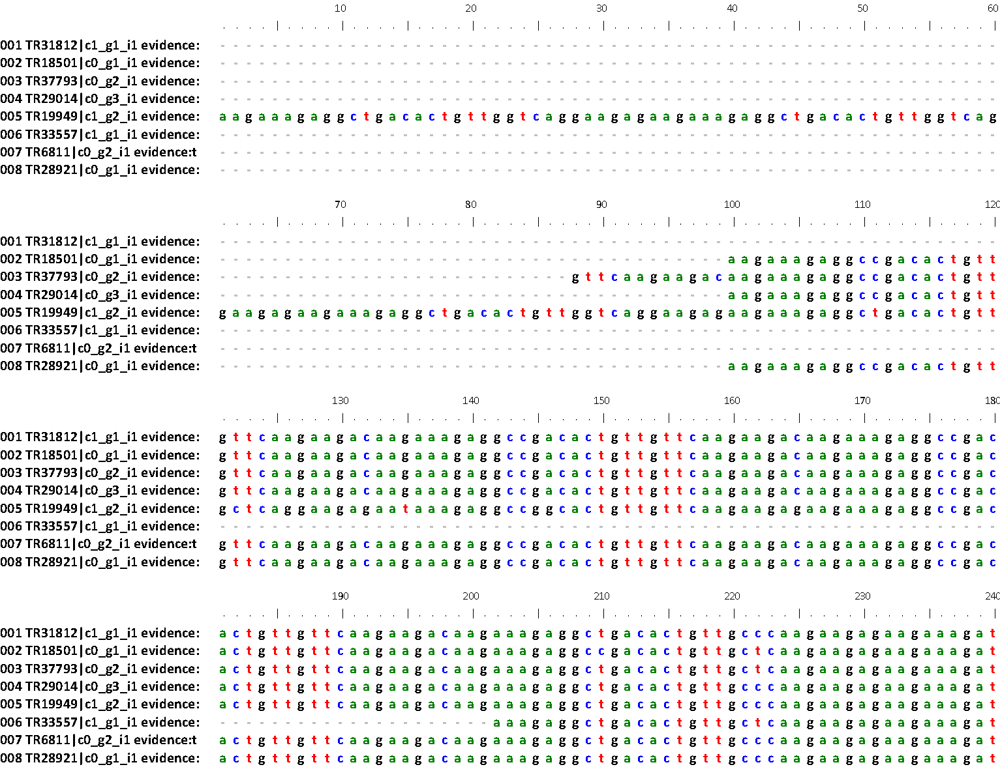

## Analysis of non-synonymous substitutions of aligned coding sequences

This is a short guide to perform an analysis of non-synonymous substitutions of 
pangenome clusters of coding sequences. 

### Dataset

We will use a set of codon-aligned sequences from barley used in https://www.frontiersin.org/articles/10.3389/fpls.2017.00184

### Codon alignments

In order to produce codon-based alignments you would need nucleotide CDS sequences and their matching peptidic sequences, such as the .fna & .faa clusters produced by GET_HOMOLOGUES-EST. The idea is to align the protein sequences and then translate that alignment to the nucleotide sequences, which become codon-aligned.

In the original barley work, trranslated CDS of single-copy sequence clusters with occupancy ≥ 4 (the minimum number of sequences required for these calculations) were aligned with [clustal-omega v1.2.1](http://www.clustal.org/omega). The resulting alignments were translated back to codon alignments using the script run_Fasta4phylogenomics.pl , which depends on multiple binaries. This script can be found at http://floresta.eead.csic.es/plant-pan-genomes/suppl_scripts . You can read more [here](https://www.ncbi.nlm.nih.gov/pmc/articles/PMC2703966) and [here](http://maya.ccg.unam.mx/primers4clades/tutorial.html)

```
mkdir nucl_t4 pep_t4 align kaks
cp cds_est_homologues/Alexis_4taxa_algOMCL_e1_/*.fna nucl_t4
cp cds_est_homologues/Alexis_4taxa_algOMCL_e1_/*.faa pep_t4

# produce cds codon alignments by copying protein-based alignments (selva)
perl run_Fasta4phylogenomics.pl -d /path/to/nucl_t4/ \
	-p /path/to/pep_t4/ -w /path/to/align/ -a -m pbs 
```

Probably most users would prefer to compute the protein alignments on their own and then use script pal2nal.pl, which can be found at https://github.com/vinuesa/get_phylomarkers/blob/master/pal2nal.pl, to create the codon alignment. Read more [here](https://www.ncbi.nlm.nih.gov/pmc/articles/PMC1538804/)

The original aligned barley clusters are compressed at [align.tbz](./align.tbz). 



*Figure*. Example alignment [my_99726_TR31812-c1_g1_i1_aln.fna](./my_99726_TR31812-c1_g1_i1_aln.fna)

Note: these sequences have had their stop codons removed.

### dN/dS Estimates

Each codon alignment was passed to yn00_cds_prealigned, obtained from https://github.com/hyphaltip/subopt-kaks, to estimate omega, the ratio of non-synonymous substitutions per non-synonymous site (dN) to the number of synonymous substitutions per synonymous site (dS) of all pairs of pre-aligned sequences in a cluster. This in turns reuses code from [PAML](https://academic.oup.com/bioinformatics/article/13/5/555/420769). 

In the barley work, after visual inspection and statistical analyses we concluded that omega values  > 1.5 indicated poorly aligned clusters. In this context, we define that sequence clusters with dN/dS ratio < 1 are under purifying selection and those with dN/dS > 1 are under positive selection.

The script [kaks_vs_occupancy_stats.R](./kaks_vs_occupancy_stats.R) produces several PDF plots to relate omega and pangenome occupancy.

```
# calculate kaks converting 99.00 omega values to 0.00
# requires folders align/ and kaks/
# requires Perl module Statistics::Basic: sudo cpan -i Statistics::Basic
perl calc_kaks.pl align/ kaks/ > kaks.tab

# make a copy and edit <omega> to omega,
# this will be used in next task
cp kaks.tab kaks4R.tab

# R-based statistical tests and plots in PDF format
# requires libraries dplyr, multcomp, gplots
Rscript kaks_vs_occupancy_stats.R

```
