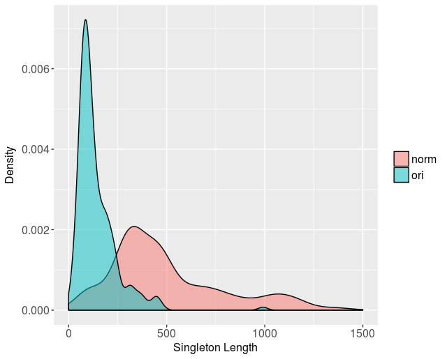
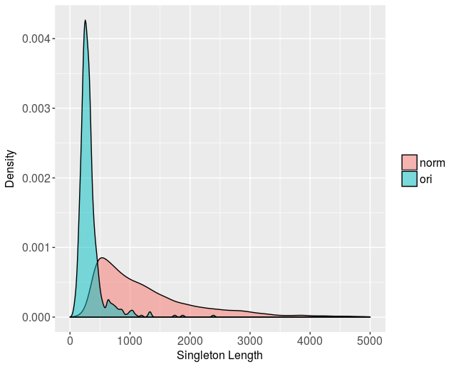
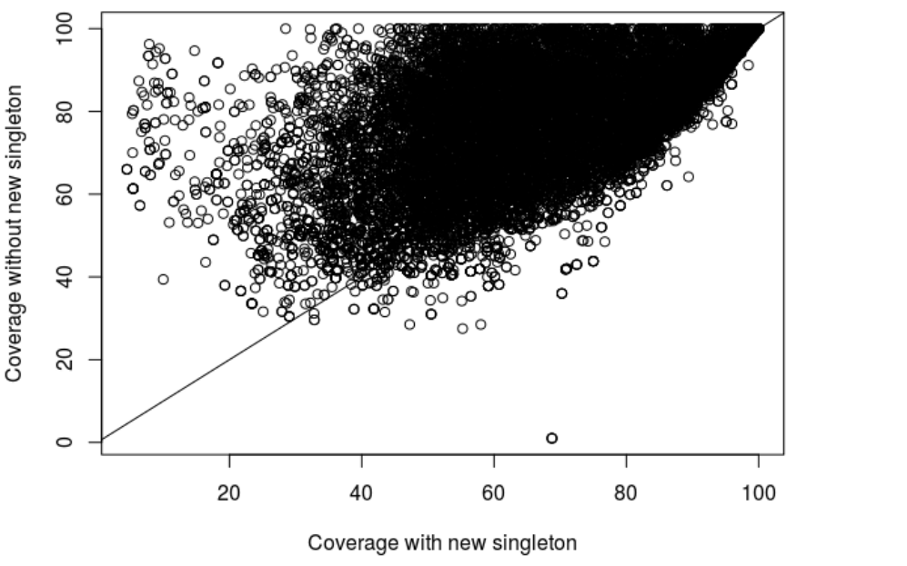

norm_bitscore.pl
================

 This Perl5 script takes a file with tab-separated BLASTP/BLASTN results, 
with the custom-format used by get_homologues, and computes length-normalized 
E-value & bitscores, as done originally in software OrthoFinder 
(https://genomebiology.biomedcentral.com/articles/10.1186/s13059-015-0721-2)

Authors: Alvaro Rodriguez del Rio and Bruno Contreras-Moreira 

## Example

You can test this script with the provided sample file as follows:

```
perl norm_bitscore.pl -i sample.blastp.gz -o sample.blastp.norm
```

## Comparing raw and normalized BLAST scores with your data

1) Calculate clusters with raw scores:

```
perl get_homologues-est.pl -d your_sequences -M -t 0 &> log.OMCL.raw
```

2) Let's say this created a folder with cluster named *your_sequences_homologues/clusters_0taxa_algOMCL_e0_*.
We'll renamed them so that they're not overwritten:

```
mv your_sequences_homologues/clusters_0taxa_algOMCL_e0_ \
  your_sequences_homologues/clusters_0taxa_algOMCL_e0_raw
mv your_sequences_homologues/clusters_0taxa_algOMCL_e0_.cluster_list \
  your_sequences_homologues/clusters_0taxa_algOMCL_e0_raw.cluster_list
```

3) Save raw BLAST outfiles and put them away in a separate folder named *raw/*:

```
cd your_sequences_homologues/
mkdir raw norm
cp *.blast.gz raw/
```

4) Compute normalized BLAST scores and put them away in a separate folder named *norm/*:

```
for FILE in *.blast.gz; do perl norm_bitscore.pl -i ori/$FILE -o norm/${FILE%.*}; done
gzip norm/*
rm -f *.blast.gz tmp/all.b*
ln -s norm/* .
cd tmp
mkdir raw
mv orthologues_010_* inparalogues_* raw/
cd ../..
```

5) Calculate clusters with normalized scores and compare them to the previous ones:

```
perl get_homologues-est.pl -d your_sequences -m cluster -M -t 0 &> log.OMCL.norm

mv your_sequences_homologues/clusters_0taxa_algOMCL_e0_ \
  your_sequences_homologues/clusters_0taxa_algOMCL_e0_norm
mv your_sequences_homologues/clusters_0taxa_algOMCL_e0_.cluster_list  
  your_sequences_homologues/clusters_0taxa_algOMCL_e0_norm.cluster_list

perl compare_clusters.pl -m -o intersection -d \
  your_sequences_homologues/clusters_0taxa_algOMCL_e0_raw,your_sequences_homologues/clusters_0taxa_algOMCL_e0_norm \
  &> log.intersection
```

## Effect on the clustering

1) Protein datasets

Sequence clusters produced by the standard and the normalized version of GET_HOMOLOGUES-EST
on the peptides of 119 isolates of the bacterial Streptophomonas genus showed some differences. 
There were 23,249 identical clusters in both runs, but 1,190 and 1,359 clusters unique 
to the standard and normalized set up, respectively. The number of clusters containing a single sequence 
(singletons) was greater (329 vs 225) and more distributed across peptide length after the normalization step (Figure 1). 



Figure 1. Length distribution of singletons in the original and normalized clustering. Singleton
sequence length after normalization is more evenly distributed across peptide length.

Some sequences originally found in clusters were clasified as singletons after normalization. 
Subtracting those sequences did not have any effect on the overall percentage of sequence identity of the clusters,
which indicates these may be miss-clustered after normalization. However, some outliers among long sequences 
increase cluster mean identity when moved to singleton clusters, indicating the use of the normalization process 
for building high quality clusters of long sequences to be used in phylogenetic analyses (Figure 2).


Figure 2. Difference in cluster % sequence identity before and after removing sequences because of
the normalization process in different length regions. Positive values indicate an increase in identity
after removing a sequence after normalization. Length was measured as the mean alignment length
reported by BLASTP for sequences within the cluster.

2) Nucleotide datasets

The clusters sets produced by the standard and normalized predictions by the
GET_HOMOLOGUES-EST protocol were very different with the transcripts of 11 species of the genus Oryza. 
In particular, there were 111,964 identical gene clusters, and 14,779 and 38,524 unique clusters in the original
and normalized results, respectively. Moreover, the number of singletons calculated by the standard
program was 612, whereas after normalization it increased to 18,126. The number of singletons
was, as in the protein dataset example, more distributed across nucleotide length after the
normalization step (Figure 3).



Figure 3. Length distribution of singletons in the original and normalized clustering. Singleton
sequence length after normalization is more evenly distributed across peptide length.

The mean BLAST coverage values of the clusters usually increased after the subtraction of
sequences because of the normalization. Manual inspection of some cases revealed that long sequences 
were subtracted from the original clusters and classified assingletons even when some regions 
aligned without mismatches with other sequences of the cluster (Figure 4). This effect of the normalization 
process might not be desired if users want to make clusters of CDS and transcripts, even if they only 
share some particular regions, such as exons, but not other regions such as introns, only present 
in transcripts. In most cases, susbtracting sequences because of normalization did not have an effect on 
the overall indentity of the clusters.



Figure 4. Coverage of the clusters before (x-axis) and after (y-axis) new singletons were sunstracted
from original clusters because of the normalization process.


